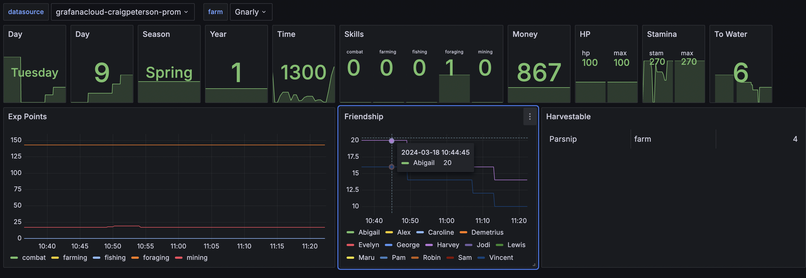

# Stardew Exporter

This is a Stardew Valley mod that exports various stats about your game so they can be consumed by prometheus and graphed.

Currently availible data:

- Game Date and Time
- Player health and stamina
- Money
- Relationship points and gift status
- Experience points and skill levels
- Counts of various objects on farm (stone, weeds, trees, etc.)
- Crop status, including harvest and watering status.

## Usage

Running the game with the mod installed will create a web server that serves metrics at `http://loclhost:8585/metrics`.

TODO: grafana agent snippets

## Dshboards

There is a sample dashboard (dash.json) in this repo you can import into grafana to see some graphs.